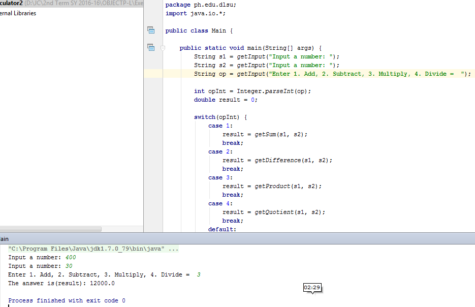

# Calculator02

~~~
package ph.edu.dlsu;
import java.io.*;

public class Main {

    public static void main(String[] args) {
        String s1 = getInput("Input a number: ");
        String s2 = getInput("Input a number: ");
        String op = getInput("Enter 1. Add, 2. Subtract, 3. Multiply, 4. Divide =  ");

        int opInt = Integer.parseInt(op);
        double result = 0;

        switch(opInt) {
            case 1:
                result = getSum(s1, s2);
                break;
            case 2:
                result = getDifference(s1, s2);
                break;
            case 3:
                result = getProduct(s1, s2);
                break;
            case 4:
                result = getQuotient(s1, s2);
                break;
            default:
                System.out.println("You entered an incorrect value");
                break;
        }

        System.out.println("The answer is(result): " + result);
    }

    private static double getQuotient(String s1, String s2) {
        double d1 = Double.parseDouble(s1);
        double d2 = Double.parseDouble(s2);
        return d1 / d2;
    }
    private static double getProduct(String s1, String s2) {
        double d1 = Double.parseDouble(s1);
        double d2 = Double.parseDouble(s2);
        return d1 * d2;
    }
    private static double getDifference(String s1, String s2) {
        double d1 = Double.parseDouble(s1);
        double d2 = Double.parseDouble(s2);
        return d1 - d2;
    }
    private static double getSum(String s1, String s2) {
        double d1 = Double.parseDouble(s1);
        double d2 = Double.parseDouble(s2);
        return d1 + d2;
    }

    private static String getInput(String prompt) {
        BufferedReader stdin = new BufferedReader(
                new InputStreamReader(System.in));

        System.out.print(prompt);
        System.out.flush();

        try {
            return stdin.readLine();
        } catch (Exception e){
            return "Error:" + e.getMessage();
        }
    }
}
~~~
